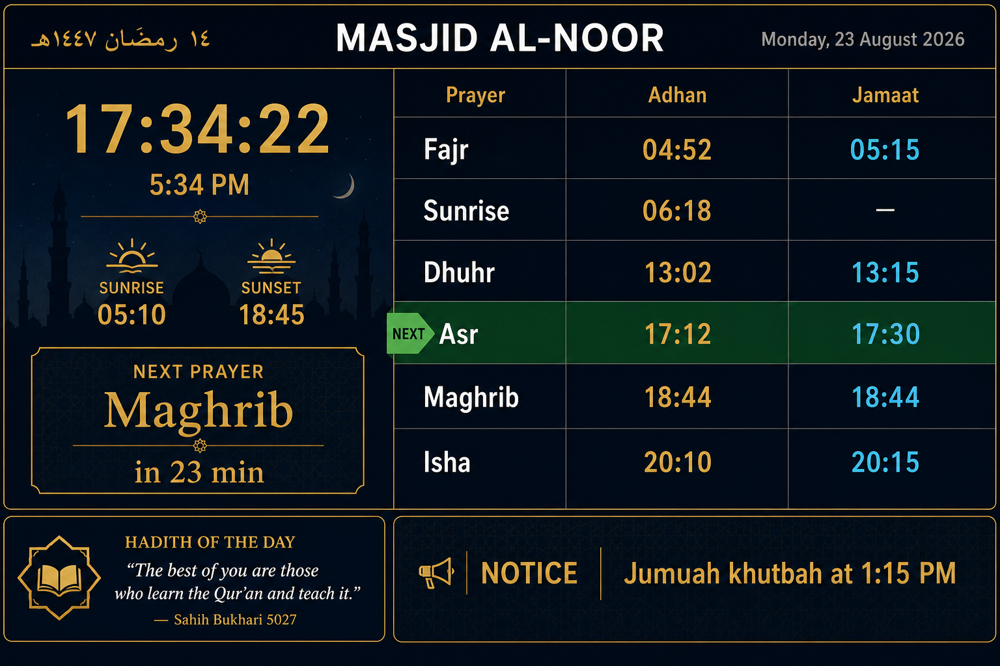
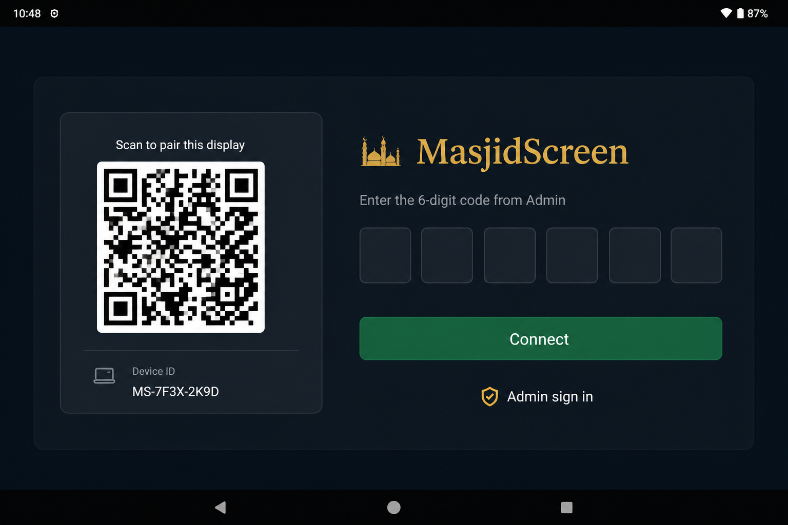
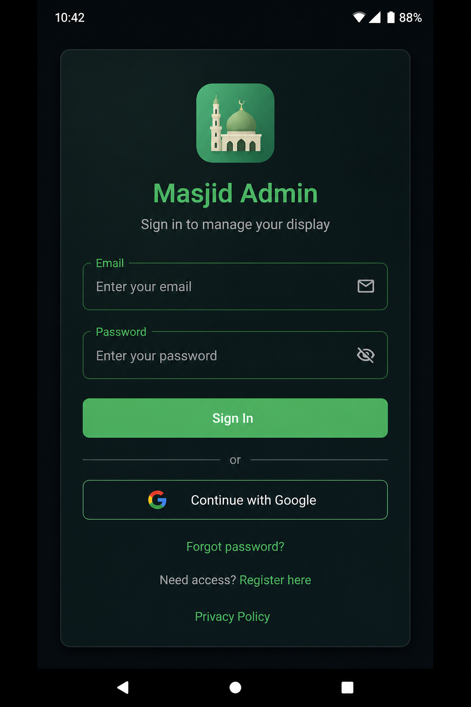

# MasjidScreen

Android app for a mosque TV or tablet. It shows live prayer times, jamaat times, Hijri and Gregorian dates, rotating hadiths, and scrolling notices. Admins sign in on the same app to manage content.

**Min SDK 26** · **Target SDK 36** · Kotlin · Jetpack Compose · Firebase

---

## Screenshots

### Mosque display



Landscape full-screen: clock, next prayer, adhan and jamaat table, hadith, and notices.

### Pair this TV



On first launch the display shows a QR code. An admin scans it (or types the 6-digit code) to attach the TV to a mosque screen.

### Admin sign-in



Email/password or Google Sign-In. From here you set jamaat times, hadiths, notices, and mosque settings.

---

## How to run

### 1. What you need

- [Android Studio](https://developer.android.com/studio) (or JDK 17 + Android SDK)
- A physical device or emulator, **API 26+**. Landscape tablet or TV box is best.
- Firebase project files (not in git — see below)
- A signing keystore on your PC (not in git)

### 2. Clone

```bash
git clone https://github.com/mirazanik/masjid-screen.git
cd masjid-screen
```

### 3. Local config (required)

These files are gitignored. Copy the examples and fill them in.

**Firebase**

```text
app/src/prod/google-services.json.example  →  app/src/prod/google-services.json
app/src/dev/google-services.json.example   →  app/src/dev/google-services.json
```

Download the real JSON from [Firebase Console](https://console.firebase.google.com) for packages:

| Flavor | Package |
|--------|---------|
| prod | `com.mirazanik.masjidscreen` |
| dev | `com.mirazanik.masjidscreen.dev` |

Until `app/src/dev/google-services.json` exists, Gradle disables **dev** variants. Prod still builds.

**Signing + SDK**

```text
local.properties.example  →  local.properties
```

Set `sdk.dir` (Android Studio usually writes this), then:

```properties
KEYSTORE_FILE=masjidscreen.keystore
KEYSTORE_PASSWORD=your-password
KEY_ALIAS=androiddebugkey
KEY_PASSWORD=your-password
```

Put the `.keystore` / `.jks` file in `app/`. Do not commit it, `google-services.json`, or `local.properties`.

Full Firebase steps: [SETUP.md](SETUP.md).

### 4. Run from Android Studio

1. Open this folder as an Android Studio project and wait for Gradle sync.
2. In the run configuration, pick **devDebug** for daily work (or **prodDebug** if you only have prod Firebase).
3. Choose a device and click Run.

The app starts in landscape. Unpaired devices show the QR pairing screen. After pairing you get the mosque display. Open admin from the pairing screen (**Admin sign in**) or from the display header.

### 5. Run from the command line

Windows:

```bat
gradlew.bat :app:installDevDebug
```

macOS / Linux:

```bash
./gradlew :app:installDevDebug
```

If dev Firebase is missing, install prod instead:

```bat
gradlew.bat :app:installProdDebug
```

### 6. Release / Play Store

```bat
gradlew.bat :app:bundleProdRelease
```

Upload `app\build\outputs\bundle\prodRelease\app-prod-release.aab` — not an APK. See [PLAY_STORE.md](PLAY_STORE.md).

---

## Flavors

| Variant | When to use |
|---------|-------------|
| **devDebug** | Local development. Separate Firebase. Can sit next to prod on the same device. |
| **prodDebug** | Debug against live Firebase. Use carefully. |
| **prodRelease** | Mosque TV and Play Store. |

Never ship a **dev** build to the live mosque screen.

---

## More docs

- [SETUP.md](SETUP.md) — Firebase, flavors, prayer methods, offline behavior
- [PLAY_STORE.md](PLAY_STORE.md) — Play Console and GitHub Pages
- [Privacy policy](https://mirazanik.github.io/masjid-screen/privacy-policy.html)
